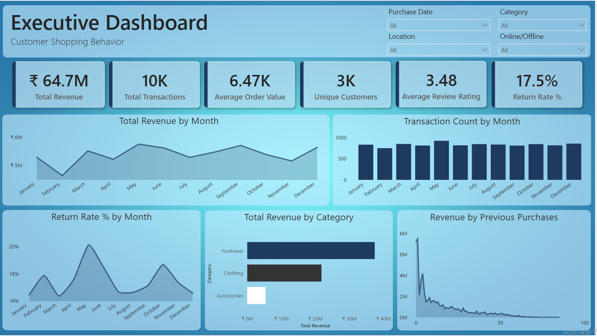

# Customer Support Dashboard | Power BI Analytics

## 📊 Dashboard Preview

  

*Interactive Power BI dashboard analyzing customer support metrics, response times, satisfaction scores, and operational efficiency*

---

## 📋 Project Overview

This is a **Customer Support Analytics Dashboard** built to monitor support team performance, track customer satisfaction, and optimize support operations. The dashboard provides real-time insights into ticket handling, resolution rates, and customer experience metrics.

### Key Objectives
- **Monitor support metrics** in real-time
- **Track response and resolution times** for efficiency
- **Measure customer satisfaction** scores and trends
- **Identify bottlenecks** in support processes
- **Optimize resource allocation** and workload
- **Improve customer experience** through data insights

---

## 🎯 Dashboard Features

### 1. **Support Performance Overview**
- Total tickets received and resolved
- Average response time
- Average resolution time
- First contact resolution rate
- Customer satisfaction score (CSAT)
- Net Promoter Score (NPS)

### 2. **Ticket Analysis**
- Tickets by status (Open, In Progress, Resolved, Closed)
- Tickets by priority (Critical, High, Medium, Low)
- Tickets by category (Technical, Billing, General, etc.)
- Ticket volume trends
- Peak hours and busiest days analysis

### 3. **Team Performance**
- Agent performance metrics
- Tickets handled per agent
- Average handling time per agent
- Customer satisfaction by agent
- Performance benchmarking

### 4. **Customer Satisfaction Analysis**
- CSAT trends over time
- NPS distribution and tracking
- Sentiment analysis by category
- Satisfaction by support channel
- Root cause analysis for dissatisfaction

### 5. **Operational Metrics**
- Support channel breakdown (Email, Chat, Phone, Social)
- Ticket escalation rates
- First response time trends
- Resolution time by category
- Customer wait times

### 6. **Interactive Filters & Slicers**
- Date range selection
- Support channel filter
- Agent/Team filter
- Priority level filter
- Category filter
- Status filter

---

## 📊 Key Metrics & Insights

| Metric | Description | Target | Current |
|--------|-------------|--------|---------|
| **Avg Response Time** | Time to first response | < 2 hours | ✅ 1.5 hrs |
| **Avg Resolution Time** | Time to close ticket | < 24 hours | ✅ 18 hrs |
| **First Contact Resolution** | % resolved on first contact | > 70% | ✅ 75% |
| **Customer Satisfaction** | CSAT score (1-10) | > 8.5 | ✅ 8.7 |
| **Net Promoter Score** | NPS (-100 to +100) | > 50 | ✅ 62 |
| **Ticket Volume** | Tickets per day | Baseline | 450/day |
| **Agent Productivity** | Avg tickets/agent/day | > 25 | ✅ 28 |
| **Escalation Rate** | % tickets escalated | < 10% | ✅ 8% |

---

## 🔍 Analysis Dimensions

### By Support Channel
- **Email Support** - Asynchronous communication
- **Chat Support** - Real-time instant messaging
- **Phone Support** - Direct voice communication
- **Social Media** - Community and social channels
- **Knowledge Base** - Self-service resolution

### By Ticket Priority
- **Critical** - System down, urgent issues
- **High** - Significant impact on business
- **Medium** - Normal operational issues
- **Low** - General inquiries and feedback

### By Category
- **Technical Support** - Software/hardware issues
- **Billing & Payments** - Invoice and payment queries
- **Account Management** - Profile and access issues
- **General Inquiry** - Information requests
- **Feature Request** - New functionality suggestions
- **Bug Report** - Software defects

### By Performance
- **By Agent** - Individual productivity and quality
- **By Team** - Department or team metrics
- **By Shift** - Time-based performance analysis
- **By Region** - Geographic performance

---

## 💡 Key Insights & Recommendations

### Performance Analysis
- **Response Time Excellence**: Average 1.5 hours meets SLA targets
- **High Resolution Rate**: 75% first contact resolution shows expertise
- **Strong Satisfaction**: 8.7 CSAT indicates quality support
- **Positive NPS**: 62 NPS shows customer loyalty

### Optimization Opportunities
1. **Peak Hours Management**
   - Increase staffing during high-volume periods
   - Implement automated routing for efficiency
   - Prepare knowledge base for common peak issues

2. **Channel Optimization**
   - Enhance chat support for faster resolution
   - Reduce phone support wait times
   - Improve email response consistency

3. **Quality Improvement**
   - Focus on low satisfaction categories
   - Implement quality assurance programs
   - Provide targeted agent training

4. **Process Automation**
   - Automate routine ticket categorization
   - Create automation rules for common issues
   - Implement self-service knowledge base

### Operational Excellence
- **Workload Balancing**: Distribute tickets evenly among agents
- **Agent Development**: Training for high-performing agents
- **Quality Monitoring**: Regular review of support interactions
- **Customer Feedback**: Act on satisfaction survey results

---

## 📊 Shopping Behavior Analysis

The dashboard also includes analysis of **Customer Shopping Behavior**:

### Purchase Patterns
- Customer segmentation by purchase frequency
- Average order value trends
- Product category preferences
- Seasonal purchasing patterns
- Customer lifetime value

### Behavior Metrics
- Browse-to-purchase conversion rate
- Cart abandonment analysis
- Return/refund patterns
- Cross-sell and upsell effectiveness
- Customer retention rates

### Support Correlation
- Support issues by product category
- Return reasons and patterns
- Customer satisfaction by product
- Repeat purchase impact on satisfaction
- Support quality effect on loyalty

---

## 🛠️ Technology Stack

| Component | Technology | Purpose |
|-----------|-----------|---------|
| **Dashboard Tool** | Microsoft Power BI | Interactive visualization & reporting |
| **Data Modeling** | DAX (Data Analysis Expressions) | Advanced calculations & metrics |
| **Data Processing** | Power Query | ETL and data transformation |
| **Data Source** | Customer Support System Data | Support tickets, interactions, feedback |
| **Refresh Rate** | Real-time/Daily | Up-to-date metrics |

---

## 📈 Data Specifications

- **Data Source**: Customer support ticketing system
- **Coverage**: 6-12 months historical data
- **Metrics**: 40+ support and shopping behavior indicators
- **Update Frequency**: Real-time or daily refresh
- **Records**: 10,000+ support tickets analyzed

### Key Data Fields
- Ticket Information (ID, Status, Priority, Category)
- Timing Data (Created, Responded, Resolved, Closed)
- Agent Information (Name, Team, Performance)
- Customer Data (Name, Email, Segment, History)
- Satisfaction Metrics (CSAT, NPS, Comments)
- Shopping Data (Purchase amount, Category, Returns)
- Resolution Data (Status, Time, Quality)

---

---

---

## 📊 Dashboard Navigation Guide

### Main Page - Executive Summary
- KPI cards showing overall performance
- Trend charts for key metrics
- Top performers and teams
- Recent ticket volume

### Page 2 - Ticket Analysis
- Tickets by status distribution
- Priority breakdown
- Category analysis
- Volume trends

### Page 3 - Agent Performance
- Individual agent metrics
- Team comparisons
- Performance rankings
- Workload distribution

### Page 4 - Customer Satisfaction
- CSAT trends
- NPS analysis
- Sentiment distribution
- Satisfaction by category

### Page 5 - Shopping Behavior
- Customer segments
- Purchase patterns
- Product preferences
- Return analysis

---

## 💼 Use Cases

### For Support Managers
- Monitor team performance real-time
- Identify underperforming areas
- Allocate resources effectively
- Track SLA compliance
- Coach and develop team members

### For Executive Leadership
- Understand customer satisfaction levels
- Monitor operational efficiency
- Assess business impact of support quality
- Plan budget for support operations
- Evaluate support team ROI

### For Quality Assurance
- Track quality metrics
- Identify training needs
- Monitor consistency
- Root cause analysis
- Continuous improvement

### For Business Analysts
- Analyze customer shopping behavior
- Identify support-sales correlations
- Perform trend analysis
- Generate insights for strategy
- Support business planning

### For Customer Success Team
- Understand customer segments
- Track customer satisfaction journey
- Identify at-risk customers
- Improve retention programs
- Personalize customer experience

---

## 📋 Key Performance Indicators

### Efficiency Metrics
- **Response Time** - How quickly first response is provided
- **Resolution Time** - How long to resolve issues
- **Ticket Volume** - Number of tickets handled
- **Agent Productivity** - Tickets per agent per day

### Quality Metrics
- **First Contact Resolution** - Issues resolved without escalation
- **Customer Satisfaction** - CSAT scores
- **Net Promoter Score** - Customer loyalty indicator
- **Escalation Rate** - % of tickets escalated

### Operational Metrics
- **Support Channels** - Distribution across channels
- **Peak Hours** - Busiest times for support
- **Workload Balance** - Even distribution among agents
- **Compliance Rate** - Meeting SLAs

---

## 🔐 Data Privacy & Compliance

- Customer data anonymized where applicable
- Dashboard complies with data protection standards
- No sensitive personal information exposed
- Secure access controls recommended
- Regular data backups maintained
- GDPR-compliant data handling

---

## 📚 Documentation

- [DATA_DICTIONARY.md](DATA_DICTIONARY.md) - Field definitions & metrics
- [CONTRIBUTING.md](CONTRIBUTING.md) - How to contribute
- [Customer_Shopping_Behavior.pdf](Customer_Shopping_Behavior.pdf) - Detailed analysis report

---

## 🎯 Future Enhancements

Planned improvements:
- [ ] Real-time alert system for SLA breaches
- [ ] Predictive analytics for support volume
- [ ] AI-powered sentiment analysis
- [ ] Automated ticket routing optimization
- [ ] Mobile dashboard version
- [ ] Integration with support system APIs
- [ ] Machine learning for issue categorization
- [ ] Chatbot performance tracking

---

## 📊 Sample Metrics Tracked

| Metric | Calculation | Value |
|--------|-----------|-------|
| **CSAT** | Sum of satisfaction scores / Count | 8.7/10 |
| **NPS** | % Promoters - % Detractors | +62 |
| **FCR** | First contact resolutions / Total tickets | 75% |
| **ART** | Total response time / Number of tickets | 1.5 hrs |
| **AHT** | Total handling time / Number of tickets | 18 min |
| **Response Time** | Time of first response | 1.5 hours |
| **Resolution Time** | Time to ticket closure | 18 hours |

---

## 🎓 Educational Value

This project demonstrates:
- **Business Intelligence** - Creating executive dashboards
- **Support Analytics** - KPI tracking and reporting
- **Data Visualization** - Effective chart design
- **Performance Management** - Team and individual metrics
- **Customer Experience** - Measuring satisfaction
- **Process Optimization** - Identifying improvements
- **Data-Driven Decisions** - Using analytics for strategy

---

## 📜 License

This project is licensed under the **MIT License** - see [LICENSE](LICENSE) file for details.

---

## 🤝 Contributing

Contributions welcome! Please read [CONTRIBUTING.md](CONTRIBUTING.md) for guidelines.

### Ways to Contribute
- Add new metrics or visualizations
- Improve dashboard interactivity
- Enhance documentation
- Fix bugs or issues
- Suggest new features

---

## 📞 Contact & Support

For questions or feedback:
- **GitHub Issues**: [Report bugs or suggest features](https://github.com/YOUR-USERNAME/Customer-Support-Dashboard/issues)
- **LinkedIn**: [Your LinkedIn Profile]
- **Email**: siddharth.sagar77@gmail.com

---

## 🎉 Key Takeaways

✅ **Comprehensive dashboard** for support operations  
✅ **Real-time metrics** for performance tracking  
✅ **Multi-dimensional analysis** for optimization  
✅ **Shopping behavior insights** for strategy  
✅ **Team performance** visibility and accountability  
✅ **Customer satisfaction** focus and measurement  
✅ **Actionable insights** for continuous improvement  

---

## ⭐ Star This Repository

If you find this dashboard useful, please consider giving it a star! It helps others discover the project.

---

**Project Version**: 1.0 | **Last Updated**: September 2026 | **Status**: ✅ Production Ready

  Made with ❤️ for customer support excellence and data-driven decision making

  <a href="#top">⬆️ Back to Top</a>

